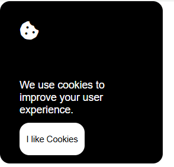

# Cookie Consent Banner

**Project 7 - Frontend - Roadmap.sh**
🔗 [Project link on roadmap.sh](https://roadmap.sh/projects/cookie-consent) *(link fictício para exemplo)*

## 📄 Description

In this project, you will create a **simple cookie consent banner** using **JavaScript**.
The banner will appear when the user visits the page, informing them about cookie usage and asking for their consent.

This project introduces you to basic **DOM manipulation** and **event handling** in JavaScript.

When the user clicks the accept button, the banner should disappear and remember the consent, so it doesn't show again on future visits (this can be done using cookies or localStorage).

## 📚 Project Goals

- Create a cookie consent banner that appears on page load.
- Use JavaScript to handle user interaction (accept button).
- Manipulate the DOM to show/hide the banner dynamically.
- Store user consent so the banner does not reappear unnecessarily.
- Style the banner with CSS to make it clear, unobtrusive, and user-friendly.
- Practice combining HTML, CSS, and JavaScript in a small interactive component.

## 🖼️ Image

